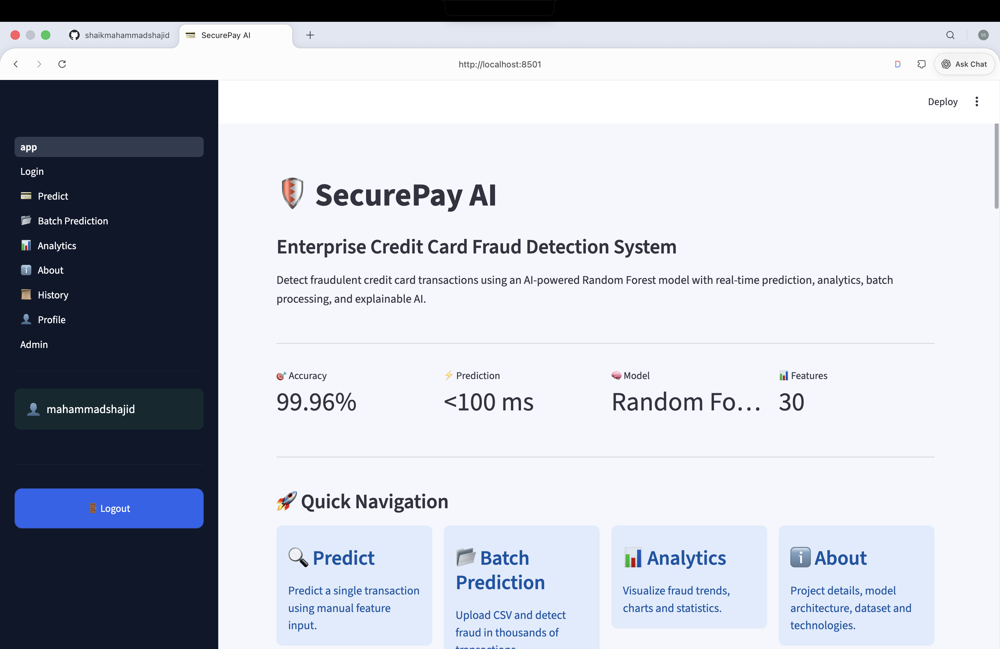
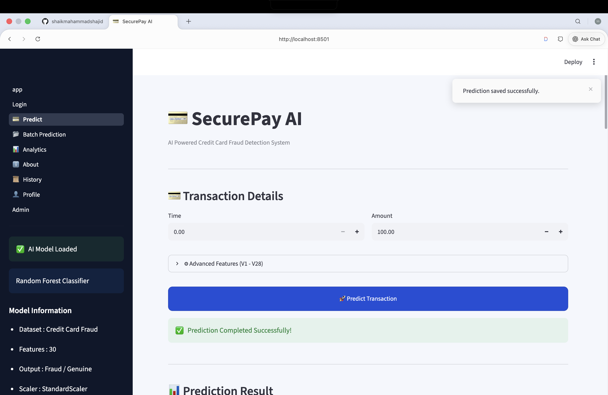
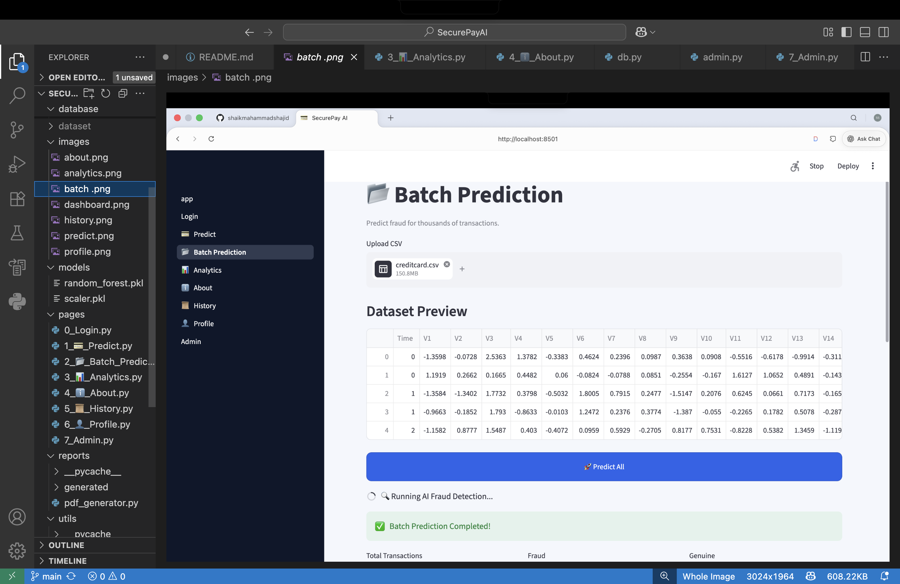
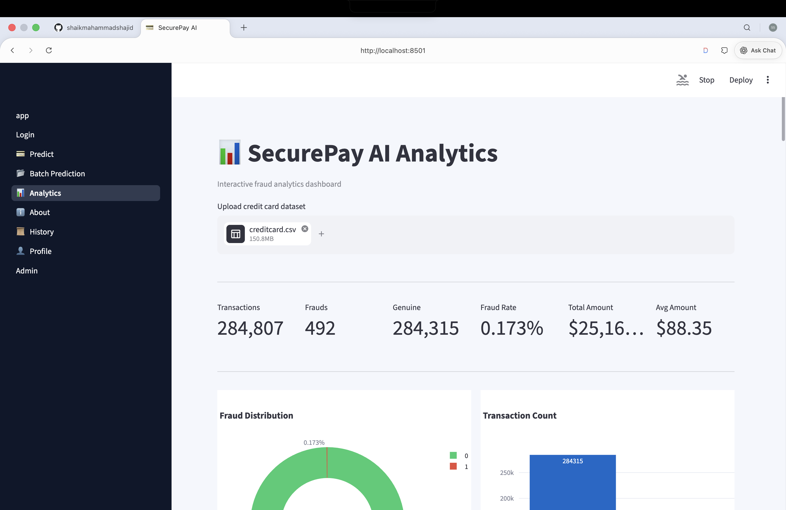
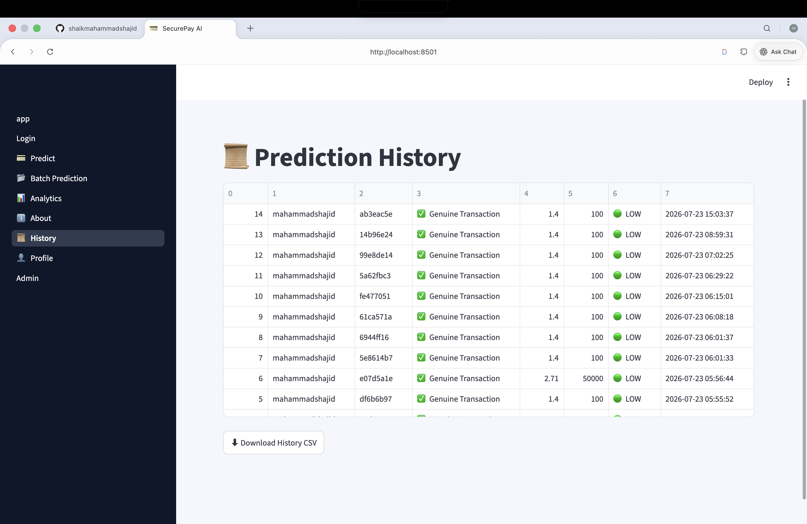
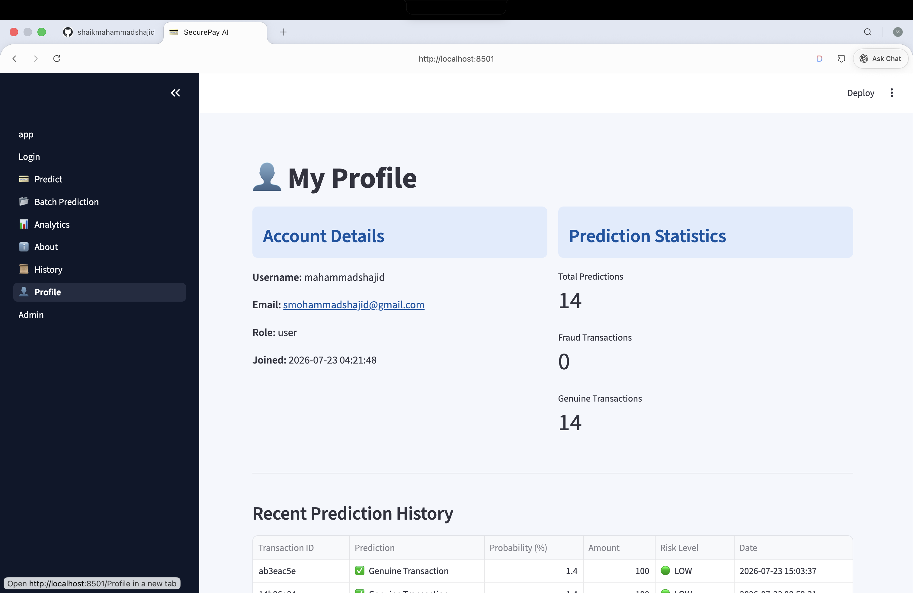
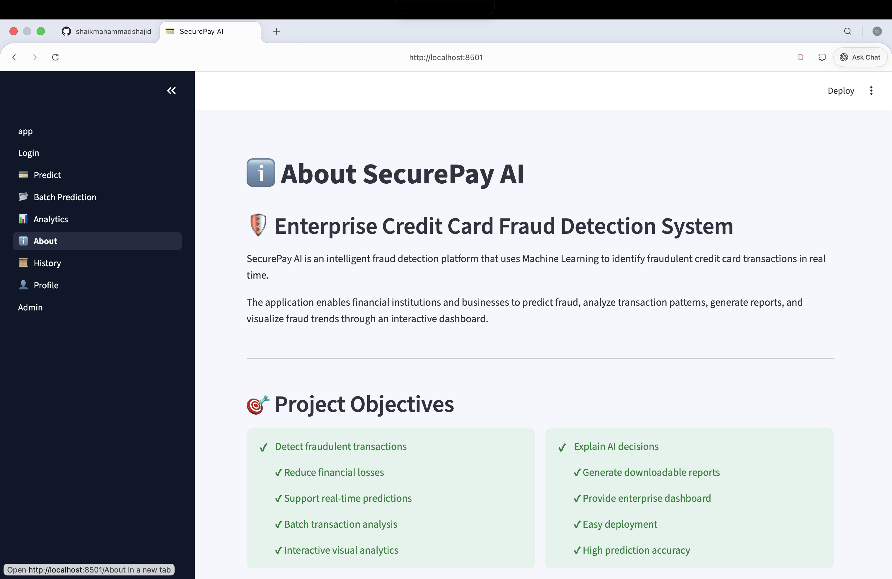

# 🛡️ SecurePay AI

<div align="center">

### 🚀 Enterprise AI-Powered Credit Card Fraud Detection System

An intelligent, production-ready web application that detects fraudulent credit card transactions using Machine Learning.


</div>

---

# 📌 Project Overview

SecurePay AI is a production-ready Machine Learning application designed to detect fraudulent credit card transactions in real time. The system combines a trained Random Forest model with an interactive Streamlit interface to provide instant fraud detection, batch prediction, analytics, secure authentication, and downloadable reports.

This project demonstrates the practical application of Artificial Intelligence and Machine Learning in financial cybersecurity.

---

# ✨ Features

- 🔐 Secure User Authentication
- 💳 Real-Time Credit Card Fraud Prediction
- 📂 Batch CSV Fraud Detection
- 📊 Interactive Analytics Dashboard
- 📈 Fraud Detection Statistics
- 📜 Prediction History
- 📄 PDF Report Generation
- 📥 CSV Export
- 🗄️ SQLite Database Integration
- 🎨 Modern Responsive Streamlit UI

---

# 🤖 Machine Learning Model

| Attribute | Details |
|-----------|---------|
| Algorithm | Random Forest Classifier |
| Dataset | European Credit Card Fraud Dataset |
| Total Transactions | 284,807 |
| Fraud Cases | 492 |
| Features | 30 |
| Prediction Type | Binary Classification |

---

# 🛠️ Technology Stack

## Frontend
- Streamlit

## Backend
- Python

## Machine Learning
- Scikit-learn
- Joblib

## Data Processing
- Pandas
- NumPy

## Data Visualization
- Plotly

## Database
- SQLite

## Report Generation
- ReportLab

---

# 📂 Project Structure

```text
SecurePayAI/
│
├── app.py
├── config.py
├── requirements.txt
├── README.md
│
├── assets/
│   └── style.css
│
├── database/
│
├── models/
│   ├── random_forest.pkl
│   └── scaler.pkl
│
├── pages/
│   ├── Login
│   ├── Predict
│   ├── Batch Prediction
│   ├── Analytics
│   ├── History
│   ├── Profile
│   └── About
│
├── reports/
│
├── utils/
│
└── images/
```

---

# 🚀 Installation

## Clone Repository

```bash
git clone https://github.com/shaikmahammadshajid-crypto/SecurePay-AI.git
```

## Navigate to Project

```bash
cd SecurePay-AI
```

## Install Requirements

```bash
pip install -r requirements.txt
```

## Run Application

```bash
streamlit run app.py
```

---

# 📊 Workflow

```text
User Login
      │
      ▼
Enter Transaction Details
      │
      ▼
Feature Scaling
      │
      ▼
Random Forest Model
      │
      ▼
Fraud Prediction
      │
      ▼
Store Results
      │
      ▼
Analytics Dashboard
      │
      ▼
Generate PDF & CSV Reports
```

---

# 🔒 Security Features

- Password Encryption using bcrypt
- Secure Login Authentication
- Protected Pages
- User-specific Prediction History
- Session Management

---

# 📈 Analytics

The application provides:

- Fraud Distribution
- Genuine Transaction Count
- Prediction Statistics
- Interactive Charts
- Historical Analysis

---

# 📷 Application Screenshot

## 🏠 Dashboard



---

## 💳 Prediction Page



---

## 📂 Batch Prediction



---

## 📊 Analytics



---

## 📜 History



---

## 👤 Profile



---

## ℹ️ About


---

# 🌐 Live Demo

👉 https://securepay-ai-dzwzcfdsgbjt3sam5c62ec.streamlit.app/

---

# 💻 GitHub Repository

👉 https://github.com/shaikmahammadshajid-crypto/SecurePay-AI
---

# 🚀 Future Enhancements

- Deep Learning Models
- Explainable AI (SHAP/LIME)
- REST API
- Banking API Integration
- Mobile Application
- Live Transaction Monitoring
- Cloud Deployment Enhancements

---

# 👨‍💻 Author

**Shaik Mahammad Shajid**

B.Tech Computer Science & Engineering (Data Science)

Presidency University

---

# 📜 License

This project is developed for educational and learning purposes.

---

<div align="center">

### ⭐ If you found this project helpful, please consider giving it a Star ⭐

</div>